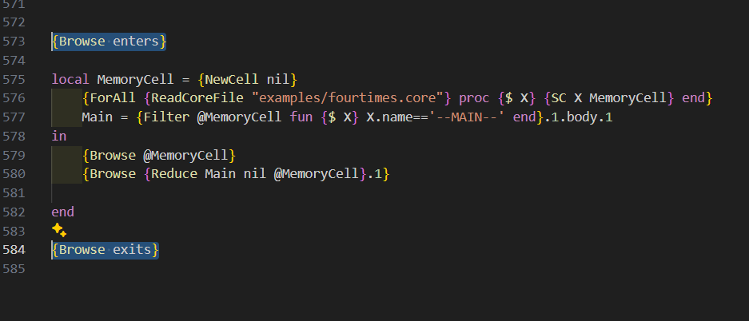

# FP Project
 - Eliam Judá Castillo Flores - 202424796
 - Martín Santiago Galván Castro – 201911013
 - Juan Camilo López Ramírez - 201312866


## HOW TO EXECUTE THE PROJECT
the only file to execute the project is ```Main.oz``` file. The project was developed using visual studio code and the mozart oz extension. So it is strongly advised to use the same setup to correctly run it.  
The first time feeding the file to the Mozart compiler, use the **feed file** option (the key shortcut is to press Ctrl+. Ctrl+B). Compiling the file while take time due to its extension. So please be patient.  
 - **IMPORTANT**: two ``{Browse ...}`` functions are called around the main execution of the program detailed in the following image

  

further executions should rather just feed this region to the compiler (shortcut is Ctrl+. Ctrl+R while selecting the region) in order to prevent possible compilation errors or delays. **The compiler sometimes will fail by not showing the browser or similar happenings**  

## ".core" FILES
there are multiple ``.core`` files that show what the language evaluator can do. 4 of this files are the base examples shared in ``examples_fp.pdf`` file. Furthermore, there are 4 ``*.core`` that ilustrate some other things that the language can do. ``6parameterfun.core`` shows that the language can handle 6 parameters in a function. Furthermore, ``10parameterfun.core`` shows that it can also handle 10. The design of the language could theoretically handle infinite parameters for a function, however it increases evaluation time considerably. Some not so exhaustive tests showed that up to 10 parameters give acceptable evaluation times. This high evaluation happens because the language does not support lazy evaluation.  
``varinmain.core`` shows a little quirk of the language in which, variables in a main execution, meaning not a function declaration, can be done and correctly evaluated.  
Lastly, the ```mainfirst.core`` shows that the language can evaluate files where the main execution is declared before the functions definitions. This is because all the file is parsed before evaluating the expresion.

## WRITTING A CUSTOM ".core" FILE
some considerations must be met when writting new ``.core`` file. The first and most important is that everything must be separated by spaces. For example, the following ``.core`` file will fail:
```
fun square x = x*x
square 2
```
and it will fail due to no spaces between the characters in ``x*x``. In order for it to work it should be rewritten to:
```
fun square x = x * x
square 2
```
the same thing goes when using ``(`` or ``)`` characters to make operations more clear. Meaning that the file:
```
fun sqr x = (x + 1) * (x - 1)
sqr 4
```
should be rewritten to:
```
fun sqr x = ( x + 1 ) * ( x - 1 )
sqr 4
```

## HOW IT WORKS?
the file ``syntax.md`` talks a little more in depth about the parsing and syntax of the language. However, in this part, the method for evaluating a tree will be explained. First, various supercombinators are generated from the language. This supercombinators are then expressed as records of the following form:
```
sc(name:funName body:[...] parameters:[...])

sc(name:'--MAIN--' body:[...] parameters:nil)
```

where the first one is the supercombinator in the example is a function definition, and the second is for the main execution of a file. Notice how in the main supercombinator, parameters is an empty list while in a function is a list. This list contains the name of the parameters later used in the body.

The contents of body is a list containing records that represent the evaluation tree. It was designed as a tree due to the inherit non-determinism of parsing an array of tokens. Either way, the tree is generated and stored in the body record. Furthermore, notice how the variable declaration is not stored. This is because, when generating the tree, the variables names are replaced by the definition of said variable.


